# מדריך המערכת לעובד — ViperLogistics

המדריך הזה מיועד לעובד בשטח, ומכסה את שלושת המסכים שאתם פוגשים בכל יום עבודה:
**שעון נוכחות**, **הלו״ז (משמרות)** ו**דוח הנוכחות**.

כל צילומי המסך כאן צולמו מהמערכת עצמה בטלפון. הנתונים בהם הם נתוני הדגמה
(עובד בשם "ישראל ישראלי", לקוחות ואירועים בדויים) — במערכת שלכם יופיעו השמות
והשעות האמיתיים שלכם.

---

## 1. איפה נמצא כל מסך

בתחתית המסך בטלפון יש חמישה כפתורים: **משמרות**, **שעון**, **דוח**, **התראות**,
ו־**עוד** שפותח את התפריט המלא. התפריט מרוכז תחת הכותרת "הנוכחות שלי".

| המסך | מה הוא עושה | איפה |
| --- | --- | --- |
| שעון נוכחות | החתמת כניסה ויציאה, ודיווחים על היום | `/my/attendance` |
| משמרות (הלו״ז) | לוח שבועי של המשמרות המשובצות לכם | `/my/schedule` |
| דוח הנוכחות שלי | שעות, שעות נוספות ושכר לפי חודש | `/attendance` |
| התראות | אילו הודעות תקבלו ובאיזה אופן | `/my/notifications` |

המערכת עובדת בדפדפן וגם כאפליקציה מותקנת (PWA). אם התקנתם אותה למסך הבית,
היא נפתחת כאפליקציה רגילה.

---

## 2. שעון נוכחות

### 2.1 לפני שמחתימים כניסה

הכפתור הירוק הגדול הוא הכניסה. מעליו מוצג הסטטוס הנוכחי, ומתחתיו כרטיס
"סיכום היום" והמידע על המשמרת המתוכננת.

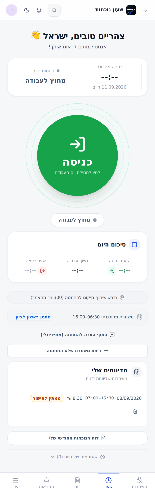

מה שחשוב לקרוא לפני הלחיצה:

- **משמרת מתוכננת** — השעות שהמערכת מצפה להן, ולידן נקודת ההתחלה: שם המחסן
  אם אתם יוצאים מהמחסן, או "שטח" אם אתם מגיעים ישר לאתר.
- **נדרש שיתוף מיקום להחתמה** — כשהשורה הזו מופיעה, ההחתמה תתבצע רק אם אתם
  בתוך הרדיוס שמצוין (בדוגמה: 300 מ׳). צריך לאשר לדפדפן גישה למיקום.
- **הוסף הערה להחתמה** — שדה חופשי ואופציונלי, נשמר על ההחתמה עצמה.

### 2.2 מה השעון בודק לפני שהוא מאשר כניסה

הכניסה נפתחת רק כשיש לכם משמרת **עכשיו**. החלון הוא שעת תחילת המשמרת פחות
"חסד" שנקבע בכרטיס העובד, ועד שעת סיום המשמרת ועוד אותו חסד.

נקודת המיקום שנמדדים מולה נגזרת מהמשמרת, לא מהשעון:

- **בכניסה** — מול נקודת ההתחלה. מי שיוצא מהמחסן נמדד מול המחסן, מי שמגיע
  לאתר נמדד מול האתר.
- **ביציאה** — מול נקודת הסיום. מי שסיים בשטח נמדד מול השטח; מי שחוזר למחסן
  נמדד מול הקרוב מבין השניים — המחסן או השטח שממנו יצא אליו.

אם לאתר או למחסן לא הוגדרו קואורדינטות, אין מול מה לאמת — ואז המסך אומר
במפורש "לא הוגדרו קואורדינטות לאתר — אפשר להחתים מכל מקום, לפי שעות המשמרת".

### 2.3 במהלך המשמרת

אחרי החתמת כניסה הכפתור מתחלף לאדום — "יציאה", הסטטוס הופך ל**נוכח בעבודה**,
ו"משך עבודה" מתחיל לרוץ בזמן אמת.

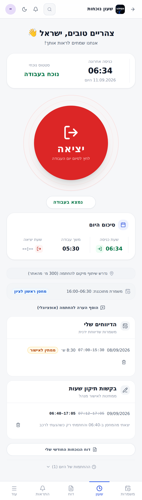

כרטיס **סיכום היום** מציג שלושה מספרים:

- **שעת כניסה** — ההחתמה הראשונה של היום.
- **משך עבודה** — מונה חי כל עוד המשמרת פתוחה; אחרי היציאה, סך השעות שנסגרו היום.
- **שעת יציאה** — היציאה האחרונה שנסגרה היום. `--:--` אומר שעדיין לא יצאתם.

### 2.4 החלק התחתון של מסך השעון

בגלילה למטה נמצאים הכרטיסים שמספרים מה קרה ומה ממתין:

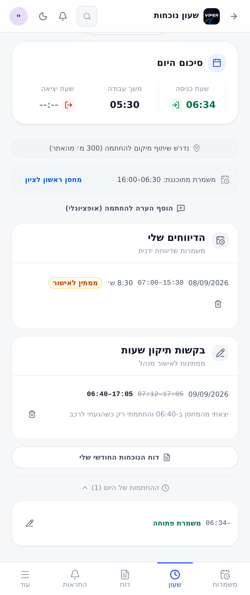

- **הדיווחים שלי** — משמרות שדיווחתם ידנית, עם הסטטוס שלהן. דיווח בסטטוס
  "ממתין לאישור" אפשר לבטל בלחיצה על פח האשפה.
- **בקשות תיקון שעות** — בקשות שנשלחו וטרם הוכרעו. השעה הרשומה מופיעה
  במחיקה, והשעה המבוקשת לידה.
- **דוח הנוכחות החודשי שלי** — קישור ישיר לדוח.
- **ההחתמות של היום (N)** — נפתח בלחיצה, ומציג כל החתמה של היום. משמרת
  שעדיין לא נסגרה מסומנת "משמרת פתוחה". ליד כל החתמה יש כפתור עיפרון
  לבקשת תיקון שעות.

### 2.5 בקשת תיקון שעות

כשההחתמה נכנסה בשעה הלא נכונה — או כשמשמרת נשארה פתוחה בלי שעת סיום — זו
הדרך לתקן. הכפתור נמצא ליד כל החתמה ברשימת "ההחתמות של היום".

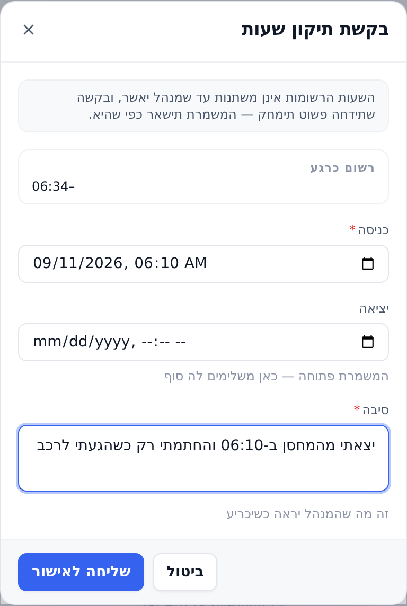

שימו לב:

- **השעות לא משתנות עד שמנהל מאשר.** בקשה שנדחית פשוט נמחקת, והמשמרת נשארת
  כפי שהיא.
- **סיבה היא שדה חובה** — זה מה שהמנהל רואה כשהוא מכריע.
- שדה **יציאה** ריק משאיר את שעת היציאה כפי שהיא. במשמרת פתוחה, זה המקום
  להשלים לה סוף.
- על משמרת שיש עליה בקשה פתוחה מופיע התג "בקשת תיקון נשלחה" במקום הכפתור,
  כדי שלא תישלח פעמיים.

### 2.6 כשהכפתור נעול

אם אין משמרת בחלון הזמן הנוכחי, הכפתור אפור והמסך אומר למה — וגם לאן ללכת
במקום זה.

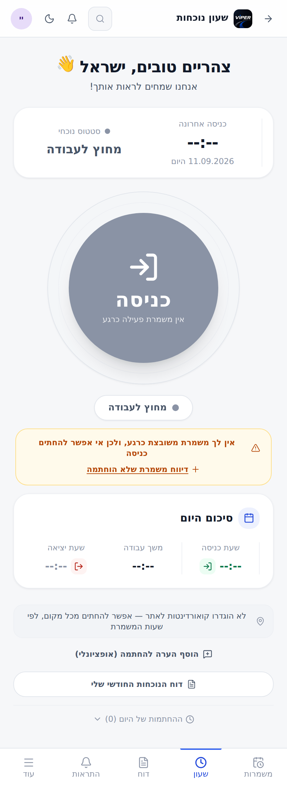

ההודעה מגיעה מהשרת, ולכן היא בדיוק זו שהייתם מקבלים אם הייתם לוחצים. ארבע
הסיבות האפשריות: השעון כבוי עבורכם, אין משמרת משובצת כרגע, מוקדם מדי, או
שהמשמרת כבר הסתיימה.

### 2.7 דיווח משמרת שלא הוחתמה

זו הדרך לדווח על עבודה שהשעון לא תפס — טלפון שנגמרה לו הסוללה, מרתף בלי
קליטה, או משמרת שנשכחה.

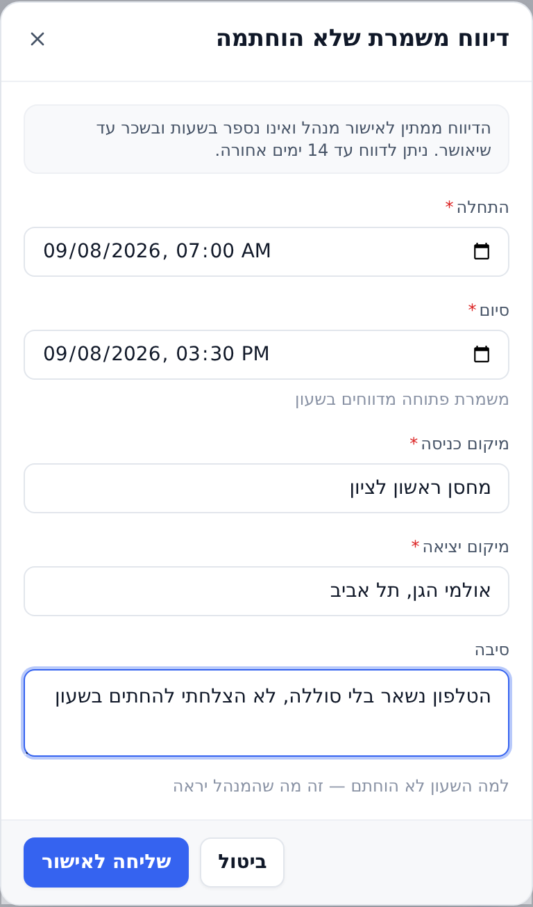

- **התחלה וסיום הן שדות חובה.** משמרת שעדיין פתוחה מדווחים בשעון, לא כאן.
- **מיקום כניסה ומיקום יציאה הם שדות חובה, במילים.** לדיווח ידני אין GPS
  לאמת מולו, ולכן המלל הוא מה שהמנהל מאשר לפיו.
- **סיבה** — למה השעון לא הוחתם.
- הדיווח נשמר בסטטוס "ממתין לאישור" ו**אינו נספר בשעות ובשכר** עד שמנהל
  יאשר אותו.
- יש חלון זמן לאחור, והוא כתוב בראש הטופס (בדוגמה: 14 ימים).

### 2.8 אין קליטה

**החתמה בלי רשת פשוט לא נכנסת.** אין תור שמשלים אותה אחר כך — השרת חותם את
השעה שבה הבקשה הגיעה אליו, ושליחה מאוחרת הייתה רושמת שעה שגויה. המערכת
תציג "אין חיבור לרשת — ההחתמה לא נקלטה".

מה לעשות: לנסות שוב כשהקליטה חוזרת, או להשתמש ב"דיווח משמרת שלא הוחתמה".

**המסכים עצמם כן עובדים בלי קליטה** — הלו״ז והשעון נטענים מהעותק השמור
במכשיר, כך שאפשר לראות את המשמרת גם בשטח בלי רשת.

### 2.9 הודעות שגיאה נפוצות במיקום

| מה שכתוב | מה לעשות |
| --- | --- |
| שיתוף המיקום נחסם | לאשר גישה למיקום בהגדרות הדפדפן, ולנסות שוב |
| לא הצלחנו לאתר את המיקום שלך | לבדוק שה־GPS פעיל ולנסות שוב |
| הדפדפן הזה אינו תומך באיתור מיקום | להשתמש בדפדפן אחר או במכשיר אחר |

---

## 3. הלו״ז — מסך המשמרות

### 3.1 התצוגה השבועית

המסך כולו הוא לוח אחד: שבוע, כל 24 השעות, בלי גלילה. מעבר בין שבועות נעשה
בהחלקה (swipe) שמאלה או ימינה. הקו האדום הוא השעה הנוכחית.

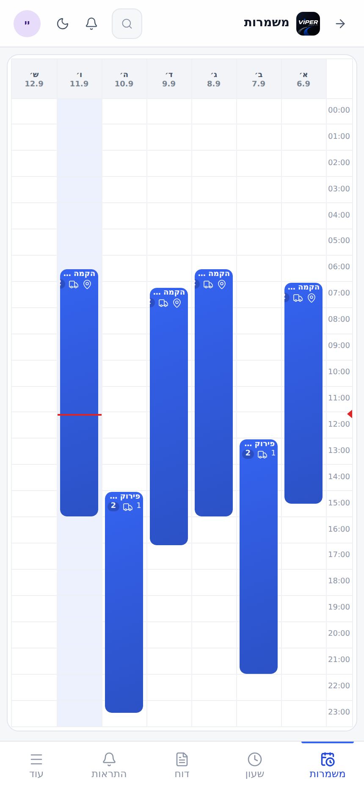

על כל משמרת כתוב:

- **שם המשמרת** — סוג העבודה והאירוע, למשל "הקמה — אולמי הגן".
- **טווח השעות** של המשמרת כולה.
- 📍 **סמן מיקום** — המשמרת מתחילה במחסן (ולא בשטח).
- 🚚 **סמן משאית** — המשמרת כוללת נסיעה חזרה למחסן בסופה, והשעה שמוצגת היא
  שעת ההגעה למחסן ולא שעת סיום העבודה.
- **מספר בעיגול** — כמה משימות יש במשמרת. לחיצה פותחת את הפירוט.

### 3.2 מאיפה המשמרת מתחילה ואיפה היא נגמרת

המשמרת אינה נקבעת ידנית — היא נגזרת מהמשימות ששובצתם אליהן:

- **ההתחלה** תלויה במה שסומן עבורכם באותה משימה. מי שיוצא מהמחסן מתחיל בשעת
  המחסן; מי שמגיע לשטח מתחיל בשעת השטח.
- **שעת מחסן שגדולה משעת השטח היא של הערב שלפני.** משימה של 11.9 שמתחילה
  ב־01:00 עם מחסן ב־23:00 יוצאת ב־23:00 של **10.9**, והמשמרת נתלית על היום
  שבו היא התחילה. הלו״ז מסמן "1-" על השעה.
- **הסיום נקבע לפי המשימה האחרונה** במשמרת. נגמרה בשטח — השעה היא שעת השטח.
  נגמרה במחסן — נוספת אליה הנסיעה חזרה.

### 3.3 פירוט המשמרת

לחיצה על משמרת פותחת מגירה עם כל מה שצריך לדעת לפני היציאה.

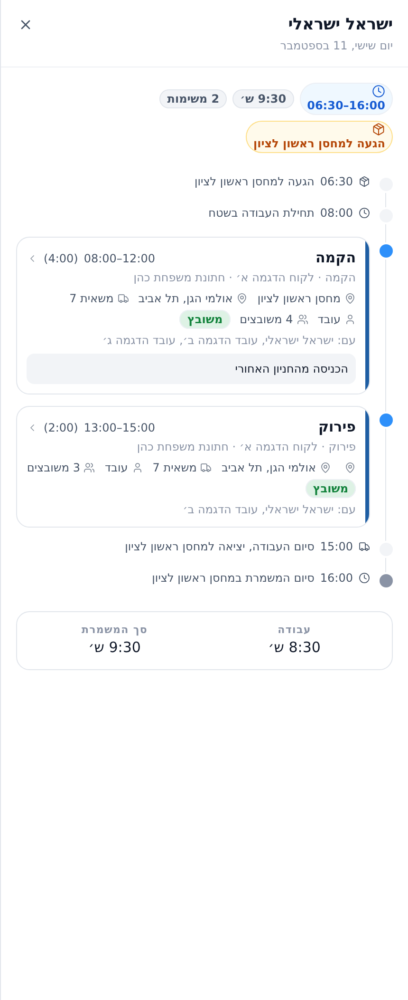

המגירה בנויה כציר זמן:

1. **הגעה למחסן** — השעה ושם המחסן, כשהמשמרת מתחילה שם.
2. **תחילת העבודה בשטח**.
3. **כרטיס לכל משימה** — סוג המשימה, טווח השעות ואורכה, הלקוח והלקוח הסופי,
   כתובת האתר, המשאית, התפקיד שלכם (עובד / נהג / ראש צוות), כמה משובצים,
   מי עוד בצוות, והערות המשימה.
4. **סיום העבודה והיציאה חזרה למחסן**.
5. **סיום המשמרת**.

בתחתית שני מספרים: **עבודה** — השעות שבהן עבדתם בפועל, ו**סך המשמרת** —
כולל הנסיעה חזרה.

---

## 4. דוח הנוכחות שלי

### 4.1 מה יש במסך

הדוח מרכז חודש שלם: כמה ימים עבדתם, כמה שעות, כמה מהן נוספות, ומה הסכום.
החצים ליד שם החודש מדפדפים בין החודשים.

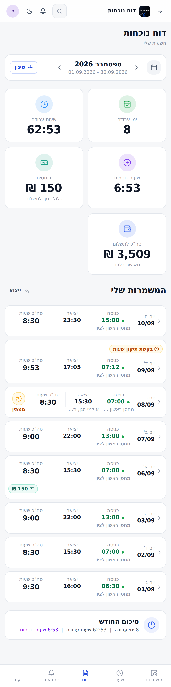

**האריחים למעלה:**

| האריח | מה הוא אומר |
| --- | --- |
| ימי עבודה | כמה משמרות מאושרות נספרו בחודש |
| שעות עבודה | סך השעות שעבדתם בפועל |
| שעות נוספות | כמה מהשעות האלה נספרו כשעות נוספות |
| בונוסים | סך הבונוסים. **כלול** בסך לתשלום ואינו נוסף עליו |
| סה״כ לתשלום | הסכום — **מאושר בלבד** |

**"מאושר בלבד" זו נקודה חשובה:** משמרת שממתינה לאישור אינה נספרת באריחים
ולא בסכום. היא מופיעה ברשימה עם התג "ממתין", ותיכנס לסיכום ברגע שתאושר.

### 4.2 כרטיס משמרת והתגים שעליו

כל שורה בדוח היא משמרת אחת: התאריך ויום השבוע, שעת כניסה ושעת יציאה, ומקום
ההחתמה מתחת לשעה. הנקודה הירוקה ליד שעת הכניסה אומרת שהמיקום אומת.

התגים שעשויים להופיע על כרטיס:

- **ממתין** (כתום) — דיווח שטרם אושר, ואינו נספר בשעות ובשכר.
- **נדחה** (אדום) — הדיווח נדחה; נימוק המנהל מופיע לידו.
- **ידני** — המשמרת דווחה ולא הוחתמה בשעון.
- **בקשת תיקון שעות** — יש בקשה פתוחה על המשמרת הזו.
- **תג סכום ירוק** (למשל ‎150 ₪) — בונוס שנקבע למשמרת.
- **תוקן** — מנהל שינה את השעות.
- **ללא משמרת משובצת** — ההחתמה נכנסה בלי שיבוץ מולו למדוד אותה.

בתחתית הרשימה יש שורת **סיכום החודש** — אותם מספרים שבאריחים, במשפט אחד,
בלי לגלול חזרה למעלה.

### 4.3 סינון וייצוא

כפתור **סינון** פותח שני מסננים: לפי סטטוס (הכול / ממתין לאישור / מאושר /
נדחה), ו"רק רשומות מסומנות" — משמרות שהשעון תלה עליהן דגל.

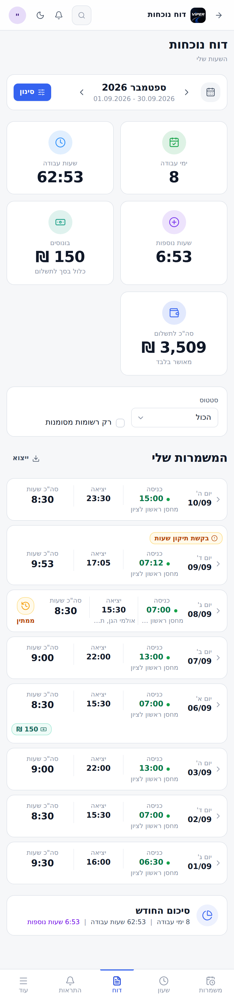

כפתור **ייצוא** מוריד קובץ Excel של בדיוק מה שמוצג במסך, כולל הסינון שהופעל.

### 4.4 פתיחת משמרת מתוך הדוח

לחיצה על שורה פותחת מגירה עם כל הפרטים — וגם דרך שנייה לבקש תיקון שעות.

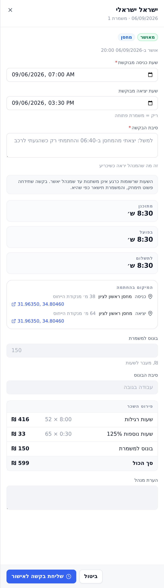

מה שהמגירה מציגה:

- **סטטוס** ומתי אושרה, ותג נקודת ההתחלה (מחסן / שטח).
- **שעת כניסה ויציאה מבוקשת** — כאן מגישים בקשת תיקון על המשמרת הזו. גם
  כאן הסיבה היא שדה חובה, והשעות לא משתנות עד אישור.
- **מתוכנן / בפועל / לתשלום** — שלוש השעות, זו מול זו.
- **המיקום בהחתמה** — המרחק מנקודת הייחוס בכניסה וביציאה, והקואורדינטות
  שנדגמו. לחיצה על הקואורדינטות פותחת אותן במפה.
- **פירוט השכר** — שורה לכל רכיב: שעות רגילות ותעריף, כל מדרגת שעות נוספות
  בנפרד, בונוס למשמרת, וסך הכול.

---

## 5. איך נספרות השעות והשכר

- **שעות נוספות** נקבעות ברמת החברה (בסיס יומי, מדרגות, יום מנוחה), והאם הן
  חלות עליכם נקבע בכרטיס העובד שלכם.
- **בונוס למשמרת הוא שורה, לא שעות.** הוא נוסף לסכום אבל אינו משפיע על
  מדרגות השעות הנוספות — כדי שבונוס זהה יהיה שווה אותו דבר לכל עובד.
- **השלמה לשעות** — "מובטחות X שעות למשמרת" — אם הוגדרה לכם, נמדדת **מתחילת
  המשמרת המתוכננת** — ולכן איחור מקצר אותה. מעל סף איחור שנקבע בכרטיס היא
  נשמטת לגמרי. מנהל יכול גם לבטל אותה על משמרת בודדת, ואז מופיע התג "ללא
  השלמה".
- **תאריך על הכרטיס הוא תאריך הכניסה בפועל.** משמרת פירוק שמתחילה ב־00:30
  ונכנסים אליה ב־23:45 מוצגת ביום שבו נכנסתם, גם אם התשלום נרשם על היום שאחריו.

---

## 6. שאלות שחוזרות

**החתמתי כניסה ושכחתי לצאת. מה עושים?**
פותחים את "ההחתמות של היום", לוחצים על העיפרון ליד המשמרת הפתוחה, ומשלימים
לה שעת יציאה בבקשת תיקון. השעות ייכנסו אחרי שמנהל יאשר.

**הכפתור אפור ואני כן בעבודה.**
קראו את ההודעה הצהובה מתחתיו — היא אומרת בדיוק למה. אם אין לכם משמרת
משובצת כרגע, הדרך היא "דיווח משמרת שלא הוחתמה".

**המערכת לא מקבלת את המיקום שלי.**
ודאו שאישרתם לדפדפן גישה למיקום ושה־GPS פעיל. אם אתם בתוך מבנה, צאו לרגע
לחוץ. אם זה לא עוזר — דווחו את המשמרת ידנית.

**עבדתי 9 שעות והדוח מראה 8:30.**
השעות מעוגלות לפי כלל עיגול שנקבע ברמת החברה. אם הפער גדול ממה שעיגול
מסביר, פתחו את המשמרת בדוח ושלחו בקשת תיקון.

**הדיווח שלי לא מופיע בסך החודשי.**
דיווח בסטטוס "ממתין לאישור" אינו נספר עד שמנהל יאשר אותו. הוא מופיע ברשימה
עם תג כתום.

**למה יש לי משמרת עם "1-" על השעה בלו״ז?**
זו משמרת שיוצאת מהמחסן בערב שלפני — שעת המחסן גדולה משעת השטח, ולכן היציאה
היא של היום הקודם.
